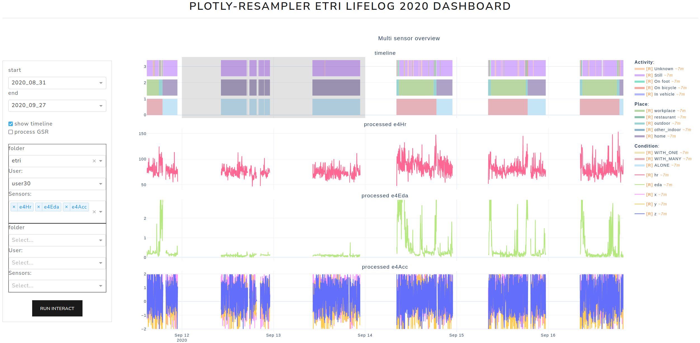

<div align="center">
<h1>:mag: Data quality challenges in wearable monitoring studies
</div>

Codebase & further details for the paper:
> 

**preprint**: `TODO` - see [cite](#cite) for bibtex

## How is the repository structured?

```txt
├── code_utils       <- module containing all shared code
│   ├── empatica     <- Empatica E4 specific code (signal processing pipelines)
│   ├── etri         <- ETRI specific code (data parsing, visualization, dashboard)
│   ├── mbrain       <- mBrain specific code
│   └── utils        <- utility code (dashboard, dataframes, interaction analysis)
├── loc_data         <- local data folder in which intermediate data is stored
└── notebooks        <- Etri and mBRAIn specific notebooks 
    ├── etri
    └── mBrain
```


### How to install the requirements?

This repository uses [poetry](https://python-poetry.org/) as dependency manager.
A specification of the dependencies is provided in the [`pyproject.toml`](pyproject.toml) and [`poetry.lock`](poetry.lock) files.

You can install the dependencies in your Python environment by executing the following steps;
1. Install poetry: https://python-poetry.org/docs/#installation
2. Activate you poetry environment by calling `poetry shell`
3. Install the dependencies by calling `poetry install`

### Utilizing this repository

Make sure that you've extended the [path_conf.py](agg_utils/path_conf.py) file's hostname if statement with your machine's hostname and that you've configured the path to the `mBrain` and `ETRI` datasets.

## Dashboards
This section elaborates on the longitudinal time series visualization dashboards for both the ETRI and mBrain datasets.

Each dashboard contains, as can be observed in the figures below, a left column with selection boxes.
The General flow to visualize a specific time series is as follows:
- Select a `folder` (in our case, al data from the ETRI and MBRAIN dataset resides within a single folder, so you can only select from one option)
- Select an user (e.g, user30 for the ETRI dataset)
> *note*: After selection a folder and user, the time-span selection will be updated to the available time-span for the selected user-folder combination
- Select sensors (e.g. 'E4 acclerometer' and 'E4 temperature')

Finally, to visualize, press the *run interact* button.


### ETRI
Once the ETRI dataset has been downloaded and parsed via the [ETRI parsing](notebooks/etri/0_parse_etri.ipynb) notebook, the corresponding [dashboard script](code_utils/etri/dashboard.py)
The dashboard can be run via the following command (after activating the poetry shell)

```bash
python code_utils/etri/dashboard.py
```
In the dashboard screenshot below, both the wearable data and the application event labels are visualized. One can immediately observe that this participant tends to be more alone during evenings (light blue shaded area of the lower row in the upper subplot). During the weekends (indicated via a gray shaded area), this participant tends to be alone and spend a lot of time at home.




### mBrain
The dashboard can be run via the following command (after activating the poetry shell)
```bash
python code_utils/mBrain/dashboard.py
```

### Cite

```bibtex
@article{TODO,
  title={TODO},
  author={Van Der Donckt, Jonas and TODO},
  journal={arXiv preprint arXiv:TODO},
  year={2023},
}
```

---

<p align="center">
👤 <i>Jonas Van Der Donckt</i>
</p>