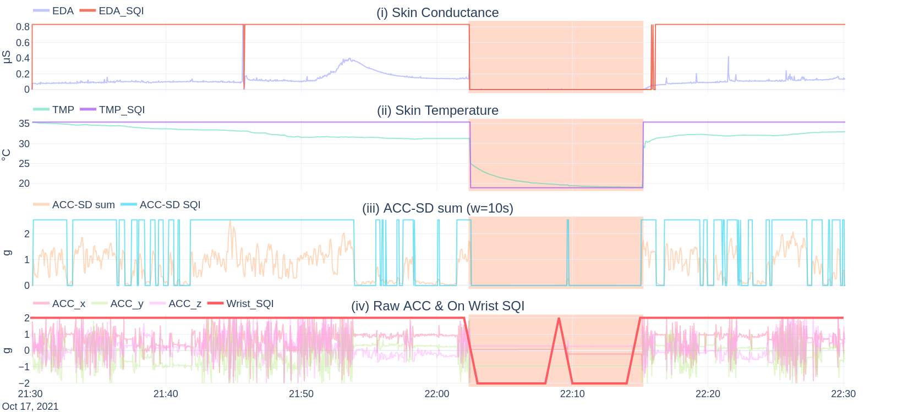

<div align="center">
<h1>:mag: Addressing Data Quality Challenges <br>in Remote Wearable Monitoring
</div>

Codebase & further details for the paper:
> Addressing Data Quality Challenges in Observational Ambulatory Studies: Analysis, methodologies and practical solutions for wrist-worn wearable monitoring

**preprint**: `TODO` - see [cite](#cite) for bibtex.

Specifically, two datasets are used to demonstrate countermeasures for data quality challenges in remote wearable monitoring.
- [ETRI lifelog 2020](https://nanum.etri.re.kr/share/schung/ETRILifelogDataset2020?lang=En_us)
- [mBrain21](TODO)
For each challenge (abbreviated as `C<ID>`), we provide a notebook that demonstrates certain countermeasures.

## 📰 How is the repository structured?

```txt
├── code_utils       <- module containing all shared code
│   ├── empatica     <- Empatica E4 specific code (signal processing pipelines)
│   ├── etri         <- ETRI specific code (data parsing, visualization, dashboard)
│   ├── mbrain       <- mBrain specific code (data parsing, visualization, dashboard)
│   └── utils        <- utility code (dashboard, dataframes, interaction analysis)
├── loc_data         <- local data folder in which intermediate data is stored
└── notebooks        <- Etri and mBrain specific notebooks 
    ├── etri
    └── mBrain
```


### 🛠️ Installation

This repository uses [poetry](https://python-poetry.org/) as dependency manager.
A specification of the dependencies is provided in the [`pyproject.toml`](pyproject.toml) and [`poetry.lock`](poetry.lock) files.

You can install the dependencies in your Python environment by executing the following steps;
1. Install poetry: https://python-poetry.org/docs/#installation
2. Activate you poetry environment by calling `poetry shell`
3. Install the dependencies by calling `poetry install`

## 🗃️ How to acquire the data? 
### ETRI lifelog 2020
The ETRI lifelog 2020 is made available at https://nanum.etri.re.kr/share/schung/ETRILifelogDataset2020?lang=En_us.
In order to download the dataset, you should first create an account on the ETRI Nanum website.
Afterwards, fill in the license agreement form, and upon approval, you will be able to download the dataset via the web platform.


### mBrain21
`TODO`<br>

A subset of the mBrain21 dataset is made available on [Kaggle datasets](). 
The dataset can be downloaded via the following command:
```bash
kaggle datasets download -d jonasvdd/mbrain21
```

### Utilizing this repository

Make sure that you've extended the [path_conf.py](agg_utils/path_conf.py) file's hostname if statement with your machine's hostname and that you've configured the path to the `mBrain` and `ETRI` datasets.

# ✨ Challenges & features
Below, a subset of exemplified challenges and features are listed.


## 📷 Dashboards
This section elaborates on the longitudinal time series visualization dashboards for both the ETRI and mBrain datasets.

Each dashboard contains, as can be observed in the figures below, a left column with selection boxes.
The General flow to visualize a specific time series is as follows:
- Select a `folder` (in our case, al data from the ETRI and MBRAIN dataset resides within a single folder, so you can only select from one option)
- Select an user (e.g, user30 for the ETRI dataset)
> *note*: After selection a folder and user, the time-span selection will be updated to the available time-span for the selected user-folder combination
- Select sensors (e.g. 'E4 accelerometer' and 'E4 temperature')

Finally, to visualize, press the *run interact* button.


### ETRI
Once the ETRI dataset has been downloaded and parsed via the [ETRI parsing](notebooks/etri/0_parse_etri.ipynb) notebook, the corresponding [dashboard script](code_utils/etri/dashboard.py)
The dashboard can be run via the following command (after activating the poetry shell)

```bash
python code_utils/etri/dashboard.py
```
The output should show the following:
> *Dash is running on http://0.0.0.0:\<PORT\>*


In the dashboard screenshot below, both the wearable data and the application event labels are visualized. One can immediately observe that this participant tends to be more alone during evenings (light blue shaded area of the lower row in the upper subplot). During the weekends (indicated via a gray shaded area), this participant tends to be alone and spend a lot of time at home.


### mBrain
The dashboard can be run via the following command (after activating the poetry shell)
```bash
python code_utils/mBrain/dashboard.py
```
The output will show the following:
> *Dash is running on http://0.0.0.0:\<PORT\>*

Below, we provide a screenshot of the mBrain dashboard. As can be observed from the selection box on the left side, the dashboard shows the headache timeline of the participant, along with the Empatica E4 its accelerometer signal and the smartphone light data. When hovering over a headache event, as shown in the upper plot, one can see the associated characteristics of the headache event.


## ⌚ off-wrist detection
The wearable non-wear detection is demonstrated in the [C5.1_off_wrist_detection](notebooks/mBrain/C5_wearable_off_wrist.ipynb) notebook.<br><br>
Moreover, the [C7_missing_data](notebooks/mBrain/C7_missing_data.ipynb) notebook demonstrates how this off-wrist pipeline can be used to remove non-wear bouts as a preprocessing step.



## ✍️ Data annotation
The [C5.1_label_off_wrist](notebooks/mBrain/C5.1_Label_off_wrist.ipynb) mBrain notebook demonstrates how large bouts of time-series data can be annotated using [plotly-resampler](https://github.com/predict-idlab/plotly-resampler).

Below a demo is shown on how this annotation tool can be used to label `off-wrist` periods.


## 📖 Citation
```bibtex
@article{TODO,
  title={TODO},
  author={Van Der Donckt, Jonas and TODO},
  journal={arXiv preprint arXiv:TODO},
  year={2023},
}
```

## 📝 License
The code is available under the *imec* [license](LICENSE).

---

<p align="center">
👤 <i>Jonas Van Der Donckt</i>
</p>